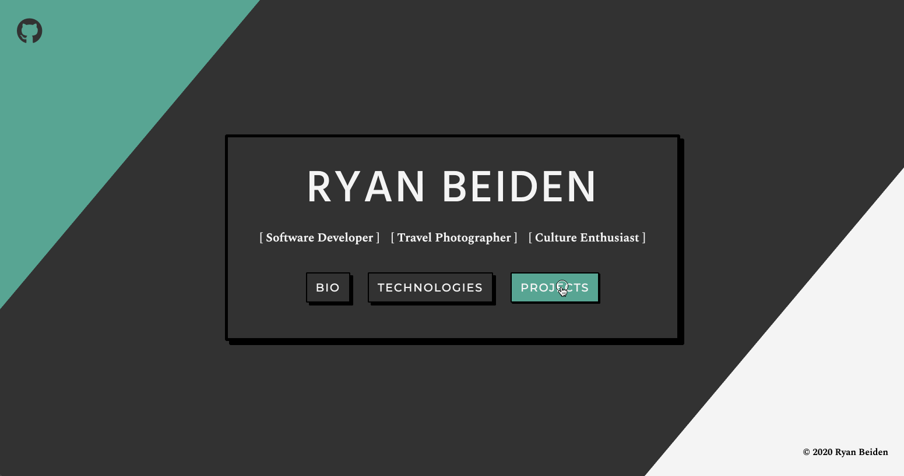
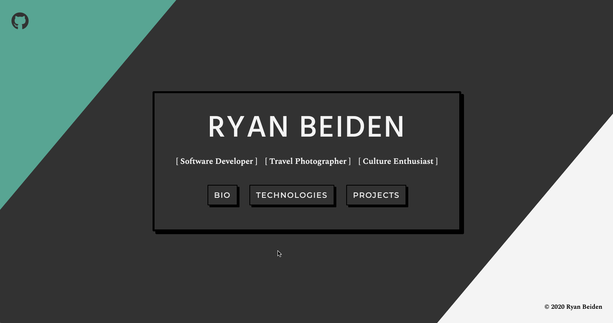

# Personal Bio Site
This web app displays my current projects (with deployed links and repository links), the technologies I work with and little bit about myself! This is a forever work in progress, enjoy!

## Preview

Projects page:

---

Bio & Technologies Pages:

## Deployed Web App

[https://ryanbeiden.web.app/](https://ryanbeiden.web.app/)

## View Project
- Clone the repository 👉🏼 `$ git clone https://github.com/RyanBeiden/personal-bio-site.git`
- Install the dependencies 👉🏼 `$ npm install`
- `$ npm start` to view 👀

## Technologies Used
   
